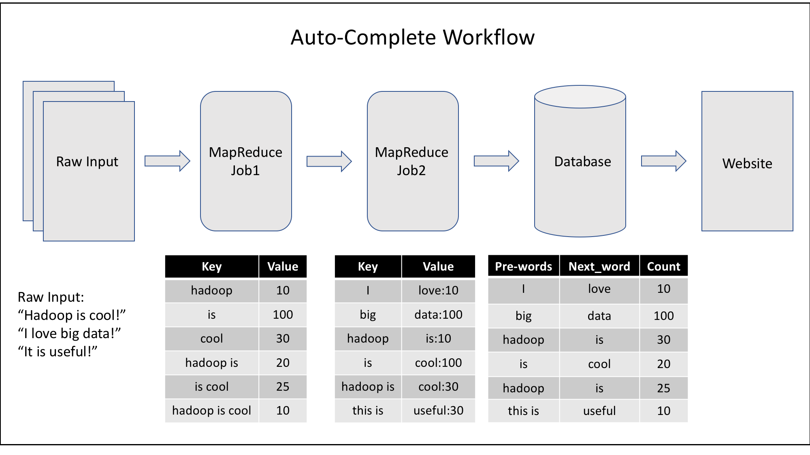
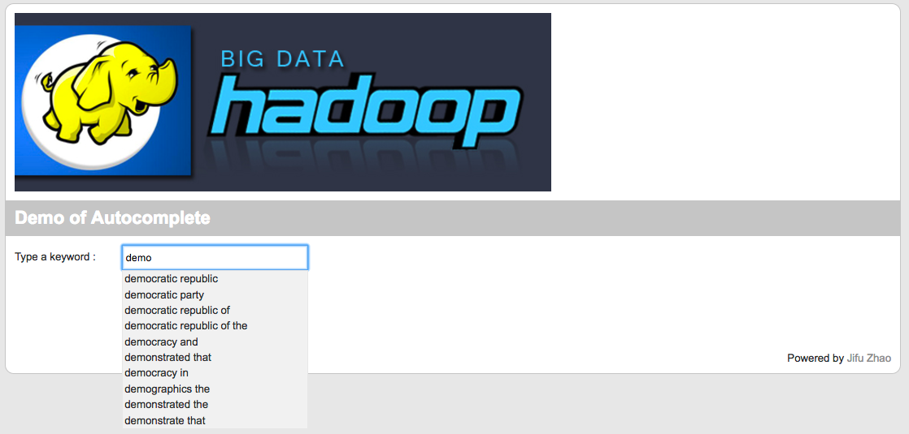
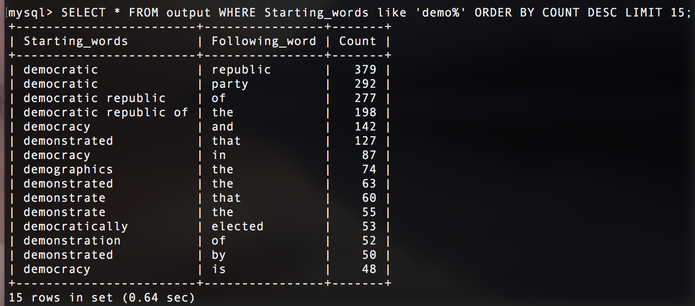

# Google-Auto-Complete
MapReduce Project: Google Search Auto Complete

A simple implementation of MapReduce to build the N-Gram model to predict the next words based on user's current input.

### Workflow

### Explanation
The job is done through two MapReduce jobs.
1. The first MapReduce job transform the raw input into the n-gram and counts in the format of: 
< key, value > = < N-gram, count >

2. The second MapReduce job use the output from the first MapReduce job and calculate the pre-words and following words as well as corresponding counts in the format of: 
< key, value > = < Pre-words, Next-word:count >

3. The output of the second MapReduce job will write into a Database. The table has three columns: 
< Pre-words, Next-word, count >

4. Finally, a simple web interface is created based on the online tutorial:  
[Autocomplete using PHP/MySQL and jQuery][link1]

### Demo

1. Demo from the web interface   
  

2. Data stored in Database   

<!--- useful link information --->
[link1]: http://www.bewebdeveloper.com/tutorial-about-autocomplete-using-php-mysql-and-jquery
