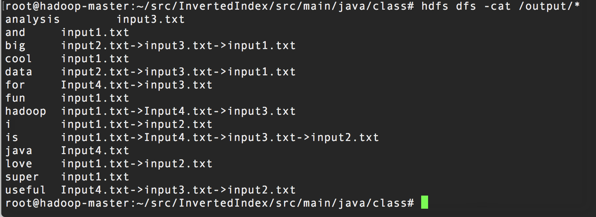

# Inverted Index

## Goal:
invert the index (file name) of each word in a collection of files

## Workflow
+ Mapper: read raw input and split into words
    - input: < offset, line of words >
    - ouput: < key=word, value=file name >

+ Reducer: merge the ouput from Mapper to count the total frequency of each word
    - input: < key=word, value=< fileName1, fileName2, ..., fileNameN > >
    - output: < key=word, value=< file1, file2, ..., fileN> >
    - output file name list should be in reverse sorted order

## Run code:
First start your Hadoop module, then enter the WordCount file by

    $: cd InvertedIndex/
    $: hdfs dfs -mkdir /input
    $: hdfs dfs -put input/* /input/
    $: cd src/main/java/
    $: hadoop com.sun.tools.javac.Main -d class *.java
    $: cd class/
    $: jar cf invertedIndex.jar *.class
    $: hadoop jar invertedIndex.jar Driver /input /output
    $: hdfs dfs -cat /output/*

### Demo of output

