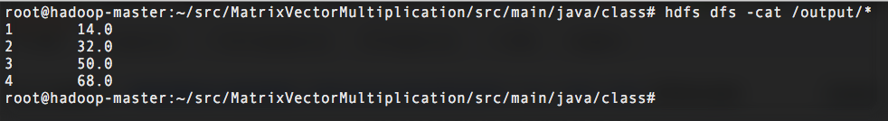

# Matrix and Vector Multiplication

## Goal:
Implement matrix and vector multiplication through Hadoop MapReduce

## Example

### Input:
* Matrix input: row, col, value  
1,1,1  
1,2,2  
1,3,3  
2,1,4  
2,2,5  
2,3,6  
3,1,7  
3,2,8  
3,3,9  
4,1,10  
4,2,11  
4,3,12  

* Vector input: row, value  
1,1  
2,2  
3,3  

## Workflow
+ MapReduce Job 1: Multiplication.java
    - Mapper 1: read raw matrix input
        - input: < offset, row,col,value >
        - ouput: < key=col, value="row=value" >

    - Mapper 2: read raw vector input
        - input: < offset, row,value >
        - ouput: < key=row, value="value" >

    - Reducer: multiply matrix and vector
        - input: < key=col, value=< row1=matrixValue1, row2=matrixValue2, ..., vectorValue > >
        - output: < key=row, value=matrixValue * vectorValue >

+ MapReduce Job 2: Summation.java
    - Mapper: read cell result from MapReduce Job 1
        - input: < offset, row \t value >
        - ouput: < key=row, value=value >

    - Reducer: calculate the sum of each row
        - input: < key=row, value=< value1, value2, ... > >
        - output: < key=row, value=sum >

## Run code:
First start your Hadoop module, then enter the MatrixVectorMultiplication file by

    $: cd MatrixVectorMultiplication/
    $: hdfs dfs -mkdir /matrix
    $: hdfs dfs -put matrix/* /matrix/
    $: hdfs dfs -mkdir /vector
    $: hdfs dfs -put vector/* /vector/
    $: cd src/main/java/
    $: hadoop com.sun.tools.javac.Main -d class *.java
    $: cd class/
    $: jar cf matrixMultiplication.jar *.class
    $: hadoop jar matrixMultiplication.jar Driver /matrix /vector /cell /output
    $: hdfs dfs -cat /output/*

### Demo of output

