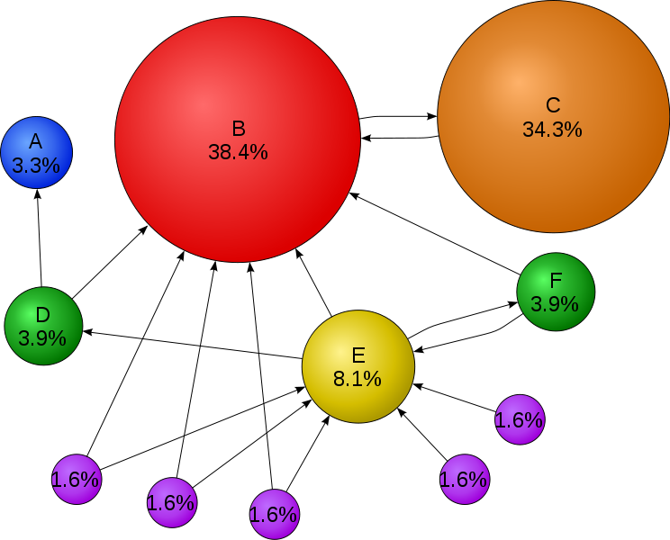
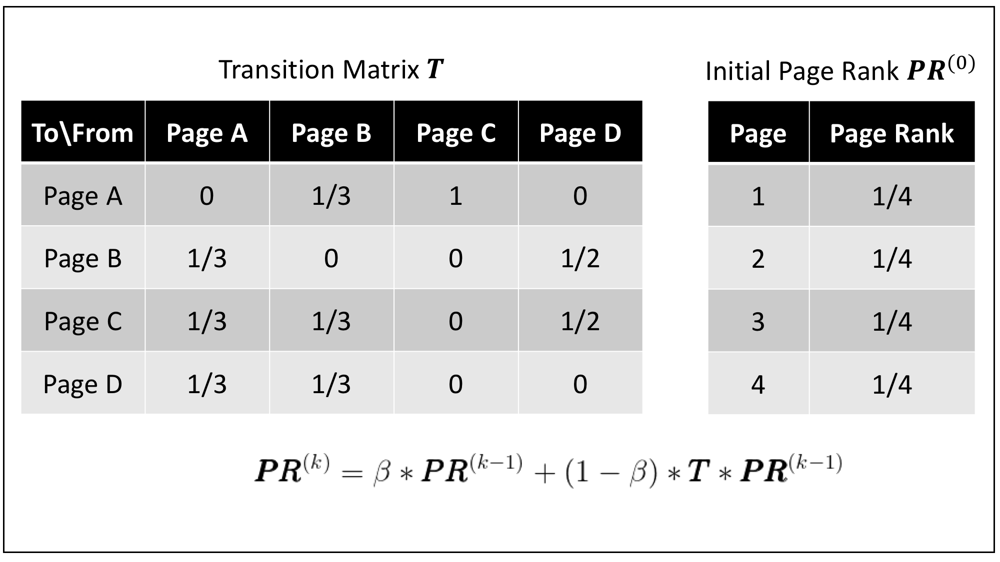
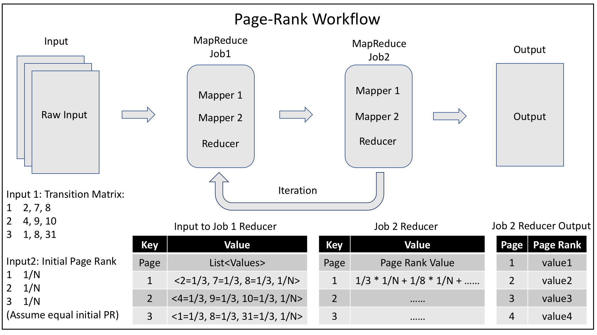

# Page-Rank
MapReduce Project: Page-Rank Algorithm

Naive implementation of Page-Rank Algorithm through MapReduce.  

## Explanation
One format of the mathematical expression for Page-Rank algorithms is shown below.  

The transition matrix T and initial page rank PR is shown below:  

## Workflow
The detailed workflow includes two MapReduce job for each iteration  

The job is done through two MapReduce jobs.

1. MapReduce Job 1
    * Mapper 1: Read transition matrix and write into the < key, value > pair format:
        - Output key = from page
        - Output value = list of < to page = weight >
        - Example: suppose page 1 is linked to page 2, 7, 8, then
            + < key, value > = < 1, 2=1/3, 7=1/3, 8=1/3 >

    * Mapper 2: Read the last page rank value and write into < key, value > pair format:
        - Output key = page
        - Output value = page rank
        - Example: (for simplicity, we assume they have the same initial page rank value 1/N)
            + < key, value > = < 1, 1/N >

    * Reducer: Combine the result from Mapper 1 and Mapper 2 together
        - Input key = from page
        - Input value = list of < to page = weight > + < page rank value >
        - Output key = to page
        - Output value = weight * page rank
        - Example:
            + Input: < key, value > = < 1, < 2=1/3, 7=1/3, 8=1/3, 1/N > >
            + Output: < key, value > = < 2, 1/3 \* 1/N >, < 7, 1/3 \* 1/N >

2. MapReduce Job 2
    * Mapper 1: Read the output from MapReduce 1 and write into < key, value > format
        - key = to page
        - value = weight * page rank value
        - Example:
            + < key, value > = < 2, 1/3 \* 1/N >, < 7, 1/3 \* 1/N >

    * Mapper 2: Read the last page rank value and write into < key, value > pair format:
        - Output key = page
        - Output value = page rank
        - Example: (for simplicity, we assume they have the same initial page rank value 1/N)
            + < key, value > = < 1, 1/N >

    * Reducer: Sum the result from Mapper together
        - key = page
        - value = new page rank value
        - Example:
            + < key, value > = < 2, 1/3 \* 1/N + 1/2 \* 1/N + ...... >

These two MapReduce job will iterate according to predefined iteration number. The source data is from [http://www.limfinity.com/ir/](http://www.limfinity.com/ir/).

## Demo
To visualize the result, we have two demos.

* Demo from the web interface (modified from online resource). Each dot represents a page. The result is calculated after 30 iterations.  

<!--- useful link information --->
[link1]: http://www.bewebdeveloper.com/tutorial-about-autocomplete-using-php-mysql-and-jquery
