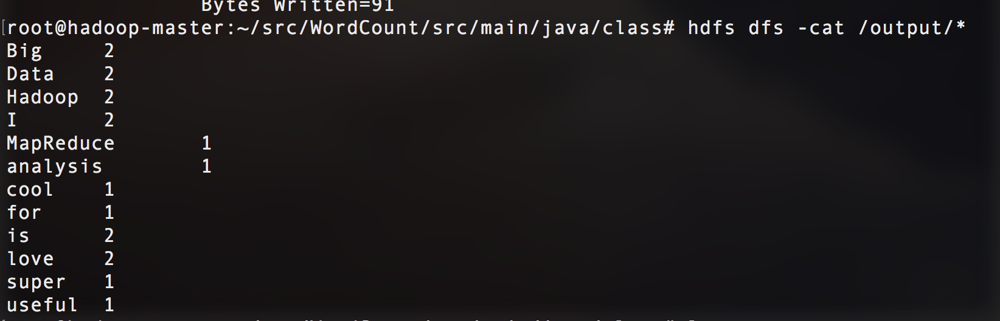

# Word Count

## Goal:
count the frequency of each word in a collection of files

## Workflow
+ Mapper: read raw input and split into words
    - input: < offset, line of words >
    - ouput: < key=word, value=1 >

+ Reducer: merge the ouput from Mapper to count the total frequency of each word
    - input: < key=word, value=< 1, 1, ... , 1 > >
    - output: < key=word, value=sum >

### Demo of output

